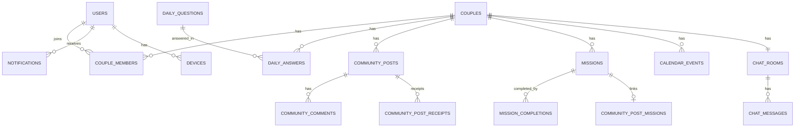

아래는 **커플 앱 MVP**(인증/캘린더/채팅/사진/다이어리/미션/반성문/설정 + **데일리 질문/알림/디바이스**) 기준으로, **MariaDB에서 바로 쓸 수 있는 현실적인 DB 설계**입니다.
핵심 원칙은 “커플 스코프 격리 + 피드형(커뮤니티) 단일화 + 채팅/캘린더 별도 도메인”입니다.

> 전제

* MariaDB 10.6+ / InnoDB
* PK는 성능 위해 `BIGINT AUTO_INCREMENT`
* 외부 노출용 식별자는 `public_id(ULID CHAR(26))`로 별도 보관(권장)

---

# 0) 전체 관계 요약(큰 그림)

* `users` 1:N `couple_members` N:1 `couples`
* 커뮤니티(사진/다이어리/반성문)는 `community_posts(category)`로 통합
* 데일리 질문은 `daily_questions`(시스템) + `daily_answers`(커플 답변)
* 미션은 상태가 필요하므로 `missions`(+ completions)로 분리
* 채팅은 `chat_rooms(커플당 1개)` + `chat_messages`
* 설정은 `user_settings`, `couple_settings`
* **[NEW]** 알림은 `notifications`, 푸시 토큰은 `devices`

---

# 1) DDL: 인증/사용자/커플

## 1.1 users

```sql
CREATE TABLE users (
  id BIGINT UNSIGNED NOT NULL AUTO_INCREMENT PRIMARY KEY,
  public_id CHAR(26) NOT NULL UNIQUE,         -- ULID

  email VARCHAR(255) NULL UNIQUE,
  phone VARCHAR(30) NULL UNIQUE,
  password_hash VARCHAR(255) NULL,

  provider ENUM('local','apple','google','kakao') NOT NULL DEFAULT 'local',
  provider_user_id VARCHAR(255) NULL,

  display_name VARCHAR(80) NOT NULL,
  avatar_asset_id BIGINT UNSIGNED NULL,

  status ENUM('active','blocked','withdrawn') NOT NULL DEFAULT 'active',
  last_seen_at DATETIME(3) NULL,

  created_at DATETIME(3) NOT NULL DEFAULT CURRENT_TIMESTAMP(3),
  updated_at DATETIME(3) NOT NULL DEFAULT CURRENT_TIMESTAMP(3) ON UPDATE CURRENT_TIMESTAMP(3)
) ENGINE=InnoDB;

CREATE INDEX idx_users_provider ON users(provider, provider_user_id);
```

## 1.2 refresh_tokens

```sql
CREATE TABLE refresh_tokens (
  id BIGINT UNSIGNED NOT NULL AUTO_INCREMENT PRIMARY KEY,
  user_id BIGINT UNSIGNED NOT NULL,
  token_hash VARCHAR(255) NOT NULL,
  expires_at DATETIME(3) NOT NULL,
  revoked_at DATETIME(3) NULL,
  created_at DATETIME(3) NOT NULL DEFAULT CURRENT_TIMESTAMP(3),

  CONSTRAINT fk_refresh_user FOREIGN KEY (user_id) REFERENCES users(id) ON DELETE CASCADE
) ENGINE=InnoDB;

CREATE INDEX idx_refresh_user ON refresh_tokens(user_id, expires_at);
```

## 1.3 couples / couple_members / invites

```sql
CREATE TABLE couples (
  id BIGINT UNSIGNED NOT NULL AUTO_INCREMENT PRIMARY KEY,
  public_id CHAR(26) NOT NULL UNIQUE,

  name VARCHAR(80) NULL,
  anniversary_date DATE NULL,
  timezone VARCHAR(50) NOT NULL DEFAULT 'Asia/Seoul',

  created_at DATETIME(3) NOT NULL DEFAULT CURRENT_TIMESTAMP(3)
) ENGINE=InnoDB;

CREATE TABLE couple_members (
  id BIGINT UNSIGNED NOT NULL AUTO_INCREMENT PRIMARY KEY,
  couple_id BIGINT UNSIGNED NOT NULL,
  user_id BIGINT UNSIGNED NOT NULL,
  role ENUM('member','admin') NOT NULL DEFAULT 'member',
  joined_at DATETIME(3) NOT NULL DEFAULT CURRENT_TIMESTAMP(3),

  CONSTRAINT fk_cm_couple FOREIGN KEY (couple_id) REFERENCES couples(id) ON DELETE CASCADE,
  CONSTRAINT fk_cm_user   FOREIGN KEY (user_id) REFERENCES users(id) ON DELETE CASCADE,
  CONSTRAINT uq_cm UNIQUE (couple_id, user_id)
) ENGINE=InnoDB;

CREATE INDEX idx_cm_user ON couple_members(user_id);

CREATE TABLE couple_invites (
  id BIGINT UNSIGNED NOT NULL AUTO_INCREMENT PRIMARY KEY,
  couple_id BIGINT UNSIGNED NOT NULL,
  inviter_user_id BIGINT UNSIGNED NOT NULL,
  code VARCHAR(32) NOT NULL UNIQUE,
  expires_at DATETIME(3) NOT NULL,
  accepted_by_user_id BIGINT UNSIGNED NULL,
  accepted_at DATETIME(3) NULL,
  status ENUM('active','expired','accepted','revoked') NOT NULL DEFAULT 'active',
  created_at DATETIME(3) NOT NULL DEFAULT CURRENT_TIMESTAMP(3),

  CONSTRAINT fk_ci_couple FOREIGN KEY (couple_id) REFERENCES couples(id) ON DELETE CASCADE,
  CONSTRAINT fk_ci_inviter FOREIGN KEY (inviter_user_id) REFERENCES users(id) ON DELETE RESTRICT,
  CONSTRAINT fk_ci_accepted FOREIGN KEY (accepted_by_user_id) REFERENCES users(id) ON DELETE SET NULL
) ENGINE=InnoDB;
```

---

# 2) DDL: 공통 에셋

```sql
CREATE TABLE assets (
  id BIGINT UNSIGNED NOT NULL AUTO_INCREMENT PRIMARY KEY,
  public_id CHAR(26) NOT NULL UNIQUE,

  couple_id BIGINT UNSIGNED NULL,
  owner_user_id BIGINT UNSIGNED NULL,

  type ENUM('image','video','file') NOT NULL DEFAULT 'image',
  mime_type VARCHAR(100) NOT NULL,
  size_bytes BIGINT UNSIGNED NOT NULL,

  storage_key VARCHAR(500) NOT NULL,
  cdn_url TEXT NOT NULL,

  width INT NULL,
  height INT NULL,

  status ENUM('uploaded','processing','ready','failed') NOT NULL DEFAULT 'ready',
  created_at DATETIME(3) NOT NULL DEFAULT CURRENT_TIMESTAMP(3),

  CONSTRAINT fk_asset_couple FOREIGN KEY (couple_id) REFERENCES couples(id) ON DELETE SET NULL,
  CONSTRAINT fk_asset_owner  FOREIGN KEY (owner_user_id) REFERENCES users(id) ON DELETE SET NULL
) ENGINE=InnoDB;

CREATE INDEX idx_assets_couple ON assets(couple_id, created_at DESC);
```

---

# 3) DDL: 커뮤니티(사진/다이어리/반성문)

```sql
CREATE TABLE community_posts (
  id BIGINT UNSIGNED NOT NULL AUTO_INCREMENT PRIMARY KEY,
  public_id CHAR(26) NOT NULL UNIQUE,

  couple_id BIGINT UNSIGNED NOT NULL,
  author_user_id BIGINT UNSIGNED NOT NULL,

  category ENUM('photo','diary','reflection') NOT NULL,

  title VARCHAR(200) NULL,
  topic VARCHAR(50) NULL, -- 반성문 주제
  content MEDIUMTEXT NULL,

  event_date DATE NULL,

  pinned TINYINT(1) NOT NULL DEFAULT 0,
  like_count INT UNSIGNED NOT NULL DEFAULT 0,
  comment_count INT UNSIGNED NOT NULL DEFAULT 0,

  created_at DATETIME(3) NOT NULL DEFAULT CURRENT_TIMESTAMP(3),
  updated_at DATETIME(3) NOT NULL DEFAULT CURRENT_TIMESTAMP(3) ON UPDATE CURRENT_TIMESTAMP(3),
  deleted_at DATETIME(3) NULL,

  CONSTRAINT fk_cp_couple FOREIGN KEY (couple_id) REFERENCES couples(id) ON DELETE CASCADE,
  CONSTRAINT fk_cp_author FOREIGN KEY (author_user_id) REFERENCES users(id) ON DELETE RESTRICT
) ENGINE=InnoDB;

CREATE INDEX idx_cp_feed ON community_posts(couple_id, created_at DESC, id DESC);

CREATE TABLE community_post_assets (
  id BIGINT UNSIGNED NOT NULL AUTO_INCREMENT PRIMARY KEY,
  post_id BIGINT UNSIGNED NOT NULL,
  asset_id BIGINT UNSIGNED NOT NULL,
  sort_order INT NOT NULL DEFAULT 0,
  created_at DATETIME(3) NOT NULL DEFAULT CURRENT_TIMESTAMP(3),

  CONSTRAINT fk_cpa_post  FOREIGN KEY (post_id) REFERENCES community_posts(id) ON DELETE CASCADE,
  CONSTRAINT fk_cpa_asset FOREIGN KEY (asset_id) REFERENCES assets(id) ON DELETE RESTRICT,
  CONSTRAINT uq_cpa UNIQUE(post_id, asset_id)
) ENGINE=InnoDB;

CREATE TABLE community_comments (
  id BIGINT UNSIGNED NOT NULL AUTO_INCREMENT PRIMARY KEY,
  public_id CHAR(26) NOT NULL UNIQUE,

  post_id BIGINT UNSIGNED NOT NULL,
  author_user_id BIGINT UNSIGNED NOT NULL,
  parent_comment_id BIGINT UNSIGNED NULL,

  content TEXT NOT NULL,

  created_at DATETIME(3) NOT NULL DEFAULT CURRENT_TIMESTAMP(3),
  updated_at DATETIME(3) NOT NULL DEFAULT CURRENT_TIMESTAMP(3) ON UPDATE CURRENT_TIMESTAMP(3),
  deleted_at DATETIME(3) NULL,

  CONSTRAINT fk_cc_post FOREIGN KEY (post_id) REFERENCES community_posts(id) ON DELETE CASCADE,
  CONSTRAINT fk_cc_author FOREIGN KEY (author_user_id) REFERENCES users(id) ON DELETE RESTRICT,
  CONSTRAINT fk_cc_parent FOREIGN KEY (parent_comment_id) REFERENCES community_comments(id) ON DELETE CASCADE
) ENGINE=InnoDB;

CREATE TABLE community_post_likes (
  id BIGINT UNSIGNED NOT NULL AUTO_INCREMENT PRIMARY KEY,
  post_id BIGINT UNSIGNED NOT NULL,
  user_id BIGINT UNSIGNED NOT NULL,
  created_at DATETIME(3) NOT NULL DEFAULT CURRENT_TIMESTAMP(3),

  CONSTRAINT fk_cpl_post FOREIGN KEY (post_id) REFERENCES community_posts(id) ON DELETE CASCADE,
  CONSTRAINT fk_cpl_user FOREIGN KEY (user_id) REFERENCES users(id) ON DELETE CASCADE,
  CONSTRAINT uq_cpl UNIQUE(post_id, user_id)
) ENGINE=InnoDB;

CREATE TABLE community_post_receipts (
  id BIGINT UNSIGNED NOT NULL AUTO_INCREMENT PRIMARY KEY,
  post_id BIGINT UNSIGNED NOT NULL,
  target_user_id BIGINT UNSIGNED NOT NULL,

  is_read TINYINT(1) NOT NULL DEFAULT 0,
  read_at DATETIME(3) NULL,
  created_at DATETIME(3) NOT NULL DEFAULT CURRENT_TIMESTAMP(3),

  CONSTRAINT fk_cpr_post FOREIGN KEY (post_id) REFERENCES community_posts(id) ON DELETE CASCADE,
  CONSTRAINT fk_cpr_user FOREIGN KEY (target_user_id) REFERENCES users(id) ON DELETE CASCADE,
  CONSTRAINT uq_cpr UNIQUE(post_id, target_user_id)
) ENGINE=InnoDB;
```

---

# 4) DDL: 데일리 질문

```sql
CREATE TABLE daily_questions (
  id BIGINT UNSIGNED NOT NULL AUTO_INCREMENT PRIMARY KEY,
  question_text VARCHAR(255) NOT NULL,
  published_date DATE NOT NULL UNIQUE,
  created_at DATETIME(3) NOT NULL DEFAULT CURRENT_TIMESTAMP(3)
) ENGINE=InnoDB;

CREATE TABLE daily_answers (
  id BIGINT UNSIGNED NOT NULL AUTO_INCREMENT PRIMARY KEY,
  couple_id BIGINT UNSIGNED NOT NULL,
  question_id BIGINT UNSIGNED NOT NULL,
  user_id BIGINT UNSIGNED NOT NULL,
  
  answer_text TEXT NOT NULL,
  
  created_at DATETIME(3) NOT NULL DEFAULT CURRENT_TIMESTAMP(3),
  
  CONSTRAINT uq_daily_answer UNIQUE(couple_id, question_id, user_id),
  CONSTRAINT fk_da_couple FOREIGN KEY (couple_id) REFERENCES couples(id) ON DELETE CASCADE,
  CONSTRAINT fk_da_question FOREIGN KEY (question_id) REFERENCES daily_questions(id) ON DELETE CASCADE
) ENGINE=InnoDB;
```

---

# 5) DDL: 미션

```sql
CREATE TABLE mission_templates (
  id BIGINT UNSIGNED NOT NULL AUTO_INCREMENT PRIMARY KEY,
  couple_id BIGINT UNSIGNED NULL,
  title VARCHAR(120) NOT NULL,
  description TEXT NULL,
  repeat_type ENUM('none','daily','weekly') NOT NULL DEFAULT 'none',
  is_active TINYINT(1) NOT NULL DEFAULT 1,
  created_at DATETIME(3) NOT NULL DEFAULT CURRENT_TIMESTAMP(3),

  CONSTRAINT fk_mt_couple FOREIGN KEY (couple_id) REFERENCES couples(id) ON DELETE CASCADE
) ENGINE=InnoDB;

CREATE TABLE missions (
  id BIGINT UNSIGNED NOT NULL AUTO_INCREMENT PRIMARY KEY,
  public_id CHAR(26) NOT NULL UNIQUE,

  couple_id BIGINT UNSIGNED NOT NULL,
  template_id BIGINT UNSIGNED NULL,

  title VARCHAR(120) NOT NULL,
  description TEXT NULL,

  assigned_date DATE NOT NULL,
  deadline DATE NULL, -- 마감일

  status ENUM('open','completed','skipped') NOT NULL DEFAULT 'open',
  reward VARCHAR(100) NULL, -- 베팅/보상

  created_by_user_id BIGINT UNSIGNED NOT NULL,
  completed_at DATETIME(3) NULL,

  created_at DATETIME(3) NOT NULL DEFAULT CURRENT_TIMESTAMP(3),

  CONSTRAINT fk_m_couple FOREIGN KEY (couple_id) REFERENCES couples(id) ON DELETE CASCADE,
  CONSTRAINT fk_m_template FOREIGN KEY (template_id) REFERENCES mission_templates(id) ON DELETE SET NULL,
  CONSTRAINT fk_m_creator FOREIGN KEY (created_by_user_id) REFERENCES users(id) ON DELETE RESTRICT
) ENGINE=InnoDB;

CREATE TABLE mission_completions (
  id BIGINT UNSIGNED NOT NULL AUTO_INCREMENT PRIMARY KEY,
  mission_id BIGINT UNSIGNED NOT NULL,
  user_id BIGINT UNSIGNED NOT NULL,
  status ENUM('completed') NOT NULL DEFAULT 'completed',
  created_at DATETIME(3) NOT NULL DEFAULT CURRENT_TIMESTAMP(3),

  CONSTRAINT fk_mc_mission FOREIGN KEY (mission_id) REFERENCES missions(id) ON DELETE CASCADE,
  CONSTRAINT fk_mc_user FOREIGN KEY (user_id) REFERENCES users(id) ON DELETE CASCADE,
  CONSTRAINT uq_mc UNIQUE(mission_id, user_id)
) ENGINE=InnoDB;

CREATE TABLE community_post_missions (
  id BIGINT UNSIGNED NOT NULL AUTO_INCREMENT PRIMARY KEY,
  post_id BIGINT UNSIGNED NOT NULL UNIQUE,
  mission_id BIGINT UNSIGNED NOT NULL,

  CONSTRAINT fk_cpm_post FOREIGN KEY (post_id) REFERENCES community_posts(id) ON DELETE CASCADE,
  CONSTRAINT fk_cpm_mission FOREIGN KEY (mission_id) REFERENCES missions(id) ON DELETE CASCADE
) ENGINE=InnoDB;
```

---

# 6) DDL: 캘린더

```sql
CREATE TABLE calendar_events (
  id BIGINT UNSIGNED NOT NULL AUTO_INCREMENT PRIMARY KEY,
  public_id CHAR(26) NOT NULL UNIQUE,

  couple_id BIGINT UNSIGNED NOT NULL,
  title VARCHAR(200) NOT NULL,
  description TEXT NULL,

  start_at DATETIME(3) NOT NULL,
  end_at DATETIME(3) NOT NULL,
  all_day TINYINT(1) NOT NULL DEFAULT 0,

  rrule VARCHAR(255) NULL,

  created_by_user_id BIGINT UNSIGNED NOT NULL,
  updated_by_user_id BIGINT UNSIGNED NOT NULL,

  linked_post_id BIGINT UNSIGNED NULL,

  created_at DATETIME(3) NOT NULL DEFAULT CURRENT_TIMESTAMP(3),
  updated_at DATETIME(3) NOT NULL DEFAULT CURRENT_TIMESTAMP(3) ON UPDATE CURRENT_TIMESTAMP(3),
  deleted_at DATETIME(3) NULL,

  CONSTRAINT fk_ce_couple FOREIGN KEY (couple_id) REFERENCES couples(id) ON DELETE CASCADE,
  CONSTRAINT fk_ce_creator FOREIGN KEY (created_by_user_id) REFERENCES users(id) ON DELETE RESTRICT,
  CONSTRAINT fk_ce_updater FOREIGN KEY (updated_by_user_id) REFERENCES users(id) ON DELETE RESTRICT,
  CONSTRAINT fk_ce_linked_post FOREIGN KEY (linked_post_id) REFERENCES community_posts(id) ON DELETE SET NULL
) ENGINE=InnoDB;

CREATE INDEX idx_ce_range ON calendar_events(couple_id, start_at, end_at);
```

---

# 7) DDL: 채팅

```sql
CREATE TABLE chat_rooms (
  id BIGINT UNSIGNED NOT NULL AUTO_INCREMENT PRIMARY KEY,
  public_id CHAR(26) NOT NULL UNIQUE,

  couple_id BIGINT UNSIGNED NOT NULL UNIQUE,
  last_message_at DATETIME(3) NULL,
  last_message_id BIGINT UNSIGNED NULL,

  created_at DATETIME(3) NOT NULL DEFAULT CURRENT_TIMESTAMP(3),

  CONSTRAINT fk_cr_couple FOREIGN KEY (couple_id) REFERENCES couples(id) ON DELETE CASCADE
) ENGINE=InnoDB;

CREATE TABLE chat_messages (
  id BIGINT UNSIGNED NOT NULL AUTO_INCREMENT PRIMARY KEY,
  public_id CHAR(26) NOT NULL UNIQUE,

  room_id BIGINT UNSIGNED NOT NULL,
  sender_user_id BIGINT UNSIGNED NOT NULL,

  type ENUM('text','image','system') NOT NULL DEFAULT 'text',
  text TEXT NULL,
  asset_id BIGINT UNSIGNED NULL,

  client_message_id VARCHAR(64) NULL,
  created_at DATETIME(3) NOT NULL DEFAULT CURRENT_TIMESTAMP(3),

  CONSTRAINT fk_cm_room FOREIGN KEY (room_id) REFERENCES chat_rooms(id) ON DELETE CASCADE,
  CONSTRAINT fk_cm_sender FOREIGN KEY (sender_user_id) REFERENCES users(id) ON DELETE RESTRICT,
  CONSTRAINT fk_cm_asset FOREIGN KEY (asset_id) REFERENCES assets(id) ON DELETE SET NULL,
  CONSTRAINT uq_cm_client UNIQUE(room_id, client_message_id)
) ENGINE=InnoDB;

CREATE INDEX idx_chat_msg_feed ON chat_messages(room_id, created_at DESC, id DESC);

CREATE TABLE chat_reads (
  id BIGINT UNSIGNED NOT NULL AUTO_INCREMENT PRIMARY KEY,
  room_id BIGINT UNSIGNED NOT NULL,
  user_id BIGINT UNSIGNED NOT NULL,
  last_read_message_id BIGINT UNSIGNED NULL,
  last_read_at DATETIME(3) NULL,

  CONSTRAINT fk_cr_room FOREIGN KEY (room_id) REFERENCES chat_rooms(id) ON DELETE CASCADE,
  CONSTRAINT fk_cr_user FOREIGN KEY (user_id) REFERENCES users(id) ON DELETE CASCADE,
  CONSTRAINT uq_read UNIQUE(room_id, user_id)
) ENGINE=InnoDB;
```

---

# 8) DDL: 설정/알림/디바이스 (운영)

## 8.1 설정
```sql
CREATE TABLE user_settings (
  id BIGINT UNSIGNED NOT NULL AUTO_INCREMENT PRIMARY KEY,
  user_id BIGINT UNSIGNED NOT NULL UNIQUE,

  push_chat TINYINT(1) NOT NULL DEFAULT 1,
  push_mission TINYINT(1) NOT NULL DEFAULT 1,
  push_community TINYINT(1) NOT NULL DEFAULT 1,

  language VARCHAR(10) NOT NULL DEFAULT 'ko',
  created_at DATETIME(3) NOT NULL DEFAULT CURRENT_TIMESTAMP(3),
  updated_at DATETIME(3) NOT NULL DEFAULT CURRENT_TIMESTAMP(3) ON UPDATE CURRENT_TIMESTAMP(3),

  CONSTRAINT fk_us_user FOREIGN KEY (user_id) REFERENCES users(id) ON DELETE CASCADE
) ENGINE=InnoDB;

CREATE TABLE couple_settings (
  id BIGINT UNSIGNED NOT NULL AUTO_INCREMENT PRIMARY KEY,
  couple_id BIGINT UNSIGNED NOT NULL UNIQUE,

  theme_version INT NOT NULL DEFAULT 1,
  theme_code VARCHAR(20) NOT NULL DEFAULT 'default', -- [앱 대응] 테마 코드

  created_at DATETIME(3) NOT NULL DEFAULT CURRENT_TIMESTAMP(3),
  updated_at DATETIME(3) NOT NULL DEFAULT CURRENT_TIMESTAMP(3) ON UPDATE CURRENT_TIMESTAMP(3),

  CONSTRAINT fk_cs_couple FOREIGN KEY (couple_id) REFERENCES couples(id) ON DELETE CASCADE
) ENGINE=InnoDB;
```

## 8.2 알림 (Notifications)
```sql
CREATE TABLE notifications (
  id BIGINT UNSIGNED NOT NULL AUTO_INCREMENT PRIMARY KEY,
  user_id BIGINT UNSIGNED NOT NULL,
  
  type ENUM('chat', 'mission', 'daily_question', 'community') NOT NULL,
  title VARCHAR(255) NOT NULL,
  content TEXT NOT NULL,
  link_url VARCHAR(255) NULL, -- Deep Link
  
  is_read TINYINT(1) NOT NULL DEFAULT 0,
  read_at DATETIME(3) NULL,
  created_at DATETIME(3) NOT NULL DEFAULT CURRENT_TIMESTAMP(3),
  
  CONSTRAINT fk_noti_user FOREIGN KEY (user_id) REFERENCES users(id) ON DELETE CASCADE
) ENGINE=InnoDB;

CREATE INDEX idx_noti_user_read ON notifications(user_id, is_read, created_at DESC);
```

## 8.3 디바이스 (Push Token)
```sql
CREATE TABLE devices (
  id BIGINT UNSIGNED NOT NULL AUTO_INCREMENT PRIMARY KEY,
  user_id BIGINT UNSIGNED NOT NULL,
  
  fcm_token VARCHAR(255) NOT NULL,
  device_type ENUM('ios', 'android') NOT NULL,
  app_version VARCHAR(20) NULL,
  
  last_active_at DATETIME(3) NOT NULL DEFAULT CURRENT_TIMESTAMP(3) ON UPDATE CURRENT_TIMESTAMP(3),
  created_at DATETIME(3) NOT NULL DEFAULT CURRENT_TIMESTAMP(3),
  
  CONSTRAINT fk_device_user FOREIGN KEY (user_id) REFERENCES users(id) ON DELETE CASCADE,
  CONSTRAINT uq_device_token UNIQUE(fcm_token)
) ENGINE=InnoDB;
```

---

# 9) ERD (관계도)


