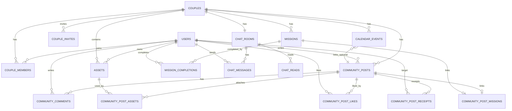

아래는 **커플 앱 MVP**(인증/캘린더/채팅/사진/다이어리/미션/반성문/설정) 기준으로, **MariaDB에서 바로 쓸 수 있는 현실적인 DB 설계**입니다.
핵심 원칙은 “커플 스코프 격리 + 피드형(커뮤니티) 단일화 + 채팅/캘린더 별도 도메인”입니다.

> 전제

* MariaDB 10.6+ / InnoDB
* PK는 성능 위해 `BIGINT AUTO_INCREMENT`
* 외부 노출용 식별자는 `public_id(ULID CHAR(26))`로 별도 보관(권장)

---

# 0) 전체 관계 요약(큰 그림)

* `users` 1:N `couple_members` N:1 `couples`
* 커뮤니티(사진/다이어리/반성문)는 `community_posts(category)`로 통합
* 미션은 상태가 필요하므로 `missions`(+ completions)로 분리, 필요하면 community와 연결
* 채팅은 `chat_rooms(커플당 1개)` + `chat_messages`
* 설정은 `user_settings`, `couple_settings`, 테마는 `themes`로 확장 가능
* “읽음/미확인”이 필요한 반성문은 `community_post_receipts`로 처리

---

# 1) DDL: 인증/사용자/커플

## 1.1 users

```sql
CREATE TABLE users (
  id BIGINT UNSIGNED NOT NULL AUTO_INCREMENT PRIMARY KEY,
  public_id CHAR(26) NOT NULL UNIQUE,         -- ULID

  email VARCHAR(255) NULL UNIQUE,
  phone VARCHAR(30) NULL UNIQUE,
  password_hash VARCHAR(255) NULL,

  provider ENUM('local','apple','google','kakao') NOT NULL DEFAULT 'local',
  provider_user_id VARCHAR(255) NULL,

  display_name VARCHAR(80) NOT NULL,
  avatar_asset_id BIGINT UNSIGNED NULL,

  status ENUM('active','blocked','withdrawn') NOT NULL DEFAULT 'active',
  last_seen_at DATETIME(3) NULL,

  created_at DATETIME(3) NOT NULL DEFAULT CURRENT_TIMESTAMP(3),
  updated_at DATETIME(3) NOT NULL DEFAULT CURRENT_TIMESTAMP(3) ON UPDATE CURRENT_TIMESTAMP(3)
) ENGINE=InnoDB;

CREATE INDEX idx_users_provider ON users(provider, provider_user_id);
```

## 1.2 refresh_tokens (JWT refresh 저장형이면 필요 / Cognito면 불필요)

```sql
CREATE TABLE refresh_tokens (
  id BIGINT UNSIGNED NOT NULL AUTO_INCREMENT PRIMARY KEY,
  user_id BIGINT UNSIGNED NOT NULL,
  token_hash VARCHAR(255) NOT NULL,
  expires_at DATETIME(3) NOT NULL,
  revoked_at DATETIME(3) NULL,
  created_at DATETIME(3) NOT NULL DEFAULT CURRENT_TIMESTAMP(3),

  CONSTRAINT fk_refresh_user FOREIGN KEY (user_id) REFERENCES users(id) ON DELETE CASCADE
) ENGINE=InnoDB;

CREATE INDEX idx_refresh_user ON refresh_tokens(user_id, expires_at);
```

## 1.3 couples / couple_members / invites

```sql
CREATE TABLE couples (
  id BIGINT UNSIGNED NOT NULL AUTO_INCREMENT PRIMARY KEY,
  public_id CHAR(26) NOT NULL UNIQUE,

  name VARCHAR(80) NULL,
  anniversary_date DATE NULL,
  timezone VARCHAR(50) NOT NULL DEFAULT 'Asia/Seoul',

  created_at DATETIME(3) NOT NULL DEFAULT CURRENT_TIMESTAMP(3)
) ENGINE=InnoDB;

CREATE TABLE couple_members (
  id BIGINT UNSIGNED NOT NULL AUTO_INCREMENT PRIMARY KEY,
  couple_id BIGINT UNSIGNED NOT NULL,
  user_id BIGINT UNSIGNED NOT NULL,
  role ENUM('member','admin') NOT NULL DEFAULT 'member',
  joined_at DATETIME(3) NOT NULL DEFAULT CURRENT_TIMESTAMP(3),

  CONSTRAINT fk_cm_couple FOREIGN KEY (couple_id) REFERENCES couples(id) ON DELETE CASCADE,
  CONSTRAINT fk_cm_user   FOREIGN KEY (user_id) REFERENCES users(id) ON DELETE CASCADE,
  CONSTRAINT uq_cm UNIQUE (couple_id, user_id)
) ENGINE=InnoDB;

CREATE INDEX idx_cm_user ON couple_members(user_id);

CREATE TABLE couple_invites (
  id BIGINT UNSIGNED NOT NULL AUTO_INCREMENT PRIMARY KEY,
  couple_id BIGINT UNSIGNED NOT NULL,
  inviter_user_id BIGINT UNSIGNED NOT NULL,
  code VARCHAR(32) NOT NULL UNIQUE,
  expires_at DATETIME(3) NOT NULL,
  accepted_by_user_id BIGINT UNSIGNED NULL,
  accepted_at DATETIME(3) NULL,
  status ENUM('active','expired','accepted','revoked') NOT NULL DEFAULT 'active',
  created_at DATETIME(3) NOT NULL DEFAULT CURRENT_TIMESTAMP(3),

  CONSTRAINT fk_ci_couple FOREIGN KEY (couple_id) REFERENCES couples(id) ON DELETE CASCADE,
  CONSTRAINT fk_ci_inviter FOREIGN KEY (inviter_user_id) REFERENCES users(id) ON DELETE RESTRICT,
  CONSTRAINT fk_ci_accepted FOREIGN KEY (accepted_by_user_id) REFERENCES users(id) ON DELETE SET NULL
) ENGINE=InnoDB;
```

> 커플 2명 제한은 DB 제약으로 강제하기 까다롭습니다. 서비스 레벨에서 `SELECT COUNT(*)` 후 제한하는 게 현실적입니다.

---

# 2) DDL: 공통 에셋(사진/채팅 이미지/아바타)

```sql
CREATE TABLE assets (
  id BIGINT UNSIGNED NOT NULL AUTO_INCREMENT PRIMARY KEY,
  public_id CHAR(26) NOT NULL UNIQUE,

  couple_id BIGINT UNSIGNED NULL,
  owner_user_id BIGINT UNSIGNED NULL,

  type ENUM('image','video','file') NOT NULL DEFAULT 'image',
  mime_type VARCHAR(100) NOT NULL,
  size_bytes BIGINT UNSIGNED NOT NULL,

  storage_key VARCHAR(500) NOT NULL,
  cdn_url TEXT NOT NULL,

  width INT NULL,
  height INT NULL,

  status ENUM('uploaded','processing','ready','failed') NOT NULL DEFAULT 'ready',
  created_at DATETIME(3) NOT NULL DEFAULT CURRENT_TIMESTAMP(3),

  CONSTRAINT fk_asset_couple FOREIGN KEY (couple_id) REFERENCES couples(id) ON DELETE SET NULL,
  CONSTRAINT fk_asset_owner  FOREIGN KEY (owner_user_id) REFERENCES users(id) ON DELETE SET NULL
) ENGINE=InnoDB;

CREATE INDEX idx_assets_couple ON assets(couple_id, created_at DESC);
```

---

# 3) DDL: 커뮤니티(사진/다이어리/반성문 통합)

사진/다이어리/반성문은 “피드/댓글/좋아요” UX가 같아서 통합 추천.

## 3.1 community_posts

```sql
CREATE TABLE community_posts (
  id BIGINT UNSIGNED NOT NULL AUTO_INCREMENT PRIMARY KEY,
  public_id CHAR(26) NOT NULL UNIQUE,

  couple_id BIGINT UNSIGNED NOT NULL,
  author_user_id BIGINT UNSIGNED NOT NULL,

  category ENUM('photo','diary','reflection') NOT NULL,

  title VARCHAR(200) NULL,
  content MEDIUMTEXT NULL,

  -- diary/mission 같은 날짜 기반 기능을 위해 추천
  event_date DATE NULL,

  pinned TINYINT(1) NOT NULL DEFAULT 0,
  like_count INT UNSIGNED NOT NULL DEFAULT 0,
  comment_count INT UNSIGNED NOT NULL DEFAULT 0,

  created_at DATETIME(3) NOT NULL DEFAULT CURRENT_TIMESTAMP(3),
  updated_at DATETIME(3) NOT NULL DEFAULT CURRENT_TIMESTAMP(3) ON UPDATE CURRENT_TIMESTAMP(3),
  deleted_at DATETIME(3) NULL,

  CONSTRAINT fk_cp_couple FOREIGN KEY (couple_id) REFERENCES couples(id) ON DELETE CASCADE,
  CONSTRAINT fk_cp_author FOREIGN KEY (author_user_id) REFERENCES users(id) ON DELETE RESTRICT
) ENGINE=InnoDB;

CREATE INDEX idx_cp_feed ON community_posts(couple_id, created_at DESC, id DESC);
CREATE INDEX idx_cp_category_feed ON community_posts(couple_id, category, created_at DESC, id DESC);
CREATE INDEX idx_cp_event_date ON community_posts(couple_id, category, event_date DESC, id DESC);
```

## 3.2 community_post_assets

```sql
CREATE TABLE community_post_assets (
  id BIGINT UNSIGNED NOT NULL AUTO_INCREMENT PRIMARY KEY,
  post_id BIGINT UNSIGNED NOT NULL,
  asset_id BIGINT UNSIGNED NOT NULL,
  sort_order INT NOT NULL DEFAULT 0,
  created_at DATETIME(3) NOT NULL DEFAULT CURRENT_TIMESTAMP(3),

  CONSTRAINT fk_cpa_post  FOREIGN KEY (post_id) REFERENCES community_posts(id) ON DELETE CASCADE,
  CONSTRAINT fk_cpa_asset FOREIGN KEY (asset_id) REFERENCES assets(id) ON DELETE RESTRICT,
  CONSTRAINT uq_cpa UNIQUE(post_id, asset_id)
) ENGINE=InnoDB;

CREATE INDEX idx_cpa_post ON community_post_assets(post_id, sort_order, id);
```

## 3.3 community_comments / likes

```sql
CREATE TABLE community_comments (
  id BIGINT UNSIGNED NOT NULL AUTO_INCREMENT PRIMARY KEY,
  public_id CHAR(26) NOT NULL UNIQUE,

  post_id BIGINT UNSIGNED NOT NULL,
  author_user_id BIGINT UNSIGNED NOT NULL,
  parent_comment_id BIGINT UNSIGNED NULL,

  content TEXT NOT NULL,

  created_at DATETIME(3) NOT NULL DEFAULT CURRENT_TIMESTAMP(3),
  updated_at DATETIME(3) NOT NULL DEFAULT CURRENT_TIMESTAMP(3) ON UPDATE CURRENT_TIMESTAMP(3),
  deleted_at DATETIME(3) NULL,

  CONSTRAINT fk_cc_post FOREIGN KEY (post_id) REFERENCES community_posts(id) ON DELETE CASCADE,
  CONSTRAINT fk_cc_author FOREIGN KEY (author_user_id) REFERENCES users(id) ON DELETE RESTRICT,
  CONSTRAINT fk_cc_parent FOREIGN KEY (parent_comment_id) REFERENCES community_comments(id) ON DELETE CASCADE
) ENGINE=InnoDB;

CREATE INDEX idx_cc_post ON community_comments(post_id, created_at ASC, id ASC);

CREATE TABLE community_post_likes (
  id BIGINT UNSIGNED NOT NULL AUTO_INCREMENT PRIMARY KEY,
  post_id BIGINT UNSIGNED NOT NULL,
  user_id BIGINT UNSIGNED NOT NULL,
  created_at DATETIME(3) NOT NULL DEFAULT CURRENT_TIMESTAMP(3),

  CONSTRAINT fk_cpl_post FOREIGN KEY (post_id) REFERENCES community_posts(id) ON DELETE CASCADE,
  CONSTRAINT fk_cpl_user FOREIGN KEY (user_id) REFERENCES users(id) ON DELETE CASCADE,
  CONSTRAINT uq_cpl UNIQUE(post_id, user_id)
) ENGINE=InnoDB;

CREATE INDEX idx_cpl_post ON community_post_likes(post_id, created_at DESC, id DESC);
```

## 3.4 reflection 읽음 처리(receipts)

```sql
CREATE TABLE community_post_receipts (
  id BIGINT UNSIGNED NOT NULL AUTO_INCREMENT PRIMARY KEY,
  post_id BIGINT UNSIGNED NOT NULL,
  target_user_id BIGINT UNSIGNED NOT NULL,

  is_read TINYINT(1) NOT NULL DEFAULT 0,
  read_at DATETIME(3) NULL,
  created_at DATETIME(3) NOT NULL DEFAULT CURRENT_TIMESTAMP(3),

  CONSTRAINT fk_cpr_post FOREIGN KEY (post_id) REFERENCES community_posts(id) ON DELETE CASCADE,
  CONSTRAINT fk_cpr_user FOREIGN KEY (target_user_id) REFERENCES users(id) ON DELETE CASCADE,
  CONSTRAINT uq_cpr UNIQUE(post_id, target_user_id)
) ENGINE=InnoDB;

CREATE INDEX idx_cpr_unread ON community_post_receipts(target_user_id, is_read, created_at DESC, id DESC);
```

> photo는 `asset 최소 1개` 규칙이 필요하지만 DB만으로 강제하기 어려워서 서비스 검증으로 처리합니다.

---

# 4) DDL: 미션(상태가 있는 도메인)

```sql
CREATE TABLE mission_templates (
  id BIGINT UNSIGNED NOT NULL AUTO_INCREMENT PRIMARY KEY,
  couple_id BIGINT UNSIGNED NULL, -- NULL이면 시스템 템플릿
  title VARCHAR(120) NOT NULL,
  description TEXT NULL,
  repeat_type ENUM('none','daily','weekly') NOT NULL DEFAULT 'none',
  is_active TINYINT(1) NOT NULL DEFAULT 1,
  created_at DATETIME(3) NOT NULL DEFAULT CURRENT_TIMESTAMP(3),

  CONSTRAINT fk_mt_couple FOREIGN KEY (couple_id) REFERENCES couples(id) ON DELETE CASCADE
) ENGINE=InnoDB;

CREATE TABLE missions (
  id BIGINT UNSIGNED NOT NULL AUTO_INCREMENT PRIMARY KEY,
  public_id CHAR(26) NOT NULL UNIQUE,

  couple_id BIGINT UNSIGNED NOT NULL,
  template_id BIGINT UNSIGNED NULL,

  title VARCHAR(120) NOT NULL,
  description TEXT NULL,

  assigned_date DATE NOT NULL,
  status ENUM('open','completed','skipped') NOT NULL DEFAULT 'open',

  created_by_user_id BIGINT UNSIGNED NOT NULL,
  completed_at DATETIME(3) NULL,

  created_at DATETIME(3) NOT NULL DEFAULT CURRENT_TIMESTAMP(3),

  CONSTRAINT fk_m_couple FOREIGN KEY (couple_id) REFERENCES couples(id) ON DELETE CASCADE,
  CONSTRAINT fk_m_template FOREIGN KEY (template_id) REFERENCES mission_templates(id) ON DELETE SET NULL,
  CONSTRAINT fk_m_creator FOREIGN KEY (created_by_user_id) REFERENCES users(id) ON DELETE RESTRICT
) ENGINE=InnoDB;

CREATE INDEX idx_m_today ON missions(couple_id, assigned_date, status);

CREATE TABLE mission_completions (
  id BIGINT UNSIGNED NOT NULL AUTO_INCREMENT PRIMARY KEY,
  mission_id BIGINT UNSIGNED NOT NULL,
  user_id BIGINT UNSIGNED NOT NULL,
  status ENUM('completed') NOT NULL DEFAULT 'completed',
  created_at DATETIME(3) NOT NULL DEFAULT CURRENT_TIMESTAMP(3),

  CONSTRAINT fk_mc_mission FOREIGN KEY (mission_id) REFERENCES missions(id) ON DELETE CASCADE,
  CONSTRAINT fk_mc_user FOREIGN KEY (user_id) REFERENCES users(id) ON DELETE CASCADE,
  CONSTRAINT uq_mc UNIQUE(mission_id, user_id)
) ENGINE=InnoDB;
```

> 미션을 커뮤니티 피드에 “글”로도 남기려면 연결 테이블 추가:

```sql
CREATE TABLE community_post_missions (
  id BIGINT UNSIGNED NOT NULL AUTO_INCREMENT PRIMARY KEY,
  post_id BIGINT UNSIGNED NOT NULL UNIQUE,
  mission_id BIGINT UNSIGNED NOT NULL,

  CONSTRAINT fk_cpm_post FOREIGN KEY (post_id) REFERENCES community_posts(id) ON DELETE CASCADE,
  CONSTRAINT fk_cpm_mission FOREIGN KEY (mission_id) REFERENCES missions(id) ON DELETE CASCADE
) ENGINE=InnoDB;
```

---

# 5) DDL: 캘린더

```sql
CREATE TABLE calendar_events (
  id BIGINT UNSIGNED NOT NULL AUTO_INCREMENT PRIMARY KEY,
  public_id CHAR(26) NOT NULL UNIQUE,

  couple_id BIGINT UNSIGNED NOT NULL,
  title VARCHAR(200) NOT NULL,
  description TEXT NULL,

  start_at DATETIME(3) NOT NULL,
  end_at DATETIME(3) NOT NULL,
  all_day TINYINT(1) NOT NULL DEFAULT 0,

  rrule VARCHAR(255) NULL, -- MVP에서는 NULL 권장(2차에서)

  created_by_user_id BIGINT UNSIGNED NOT NULL,
  updated_by_user_id BIGINT UNSIGNED NOT NULL,

  linked_post_id BIGINT UNSIGNED NULL, -- 다이어리/사진과 연결하고 싶을 때

  created_at DATETIME(3) NOT NULL DEFAULT CURRENT_TIMESTAMP(3),
  updated_at DATETIME(3) NOT NULL DEFAULT CURRENT_TIMESTAMP(3) ON UPDATE CURRENT_TIMESTAMP(3),
  deleted_at DATETIME(3) NULL,

  CONSTRAINT fk_ce_couple FOREIGN KEY (couple_id) REFERENCES couples(id) ON DELETE CASCADE,
  CONSTRAINT fk_ce_creator FOREIGN KEY (created_by_user_id) REFERENCES users(id) ON DELETE RESTRICT,
  CONSTRAINT fk_ce_updater FOREIGN KEY (updated_by_user_id) REFERENCES users(id) ON DELETE RESTRICT,
  CONSTRAINT fk_ce_linked_post FOREIGN KEY (linked_post_id) REFERENCES community_posts(id) ON DELETE SET NULL
) ENGINE=InnoDB;

CREATE INDEX idx_ce_range ON calendar_events(couple_id, start_at, end_at);
```

> iOS/Android 타임존 이슈를 줄이려면, 서버는 UTC로 저장하고 클라에서 로컬 변환하는 방식이 안정적입니다. (DATETIME에 타임존이 없으므로 규칙을 정해야 함)

---

# 6) DDL: 채팅(커플당 1룸)

```sql
CREATE TABLE chat_rooms (
  id BIGINT UNSIGNED NOT NULL AUTO_INCREMENT PRIMARY KEY,
  public_id CHAR(26) NOT NULL UNIQUE,

  couple_id BIGINT UNSIGNED NOT NULL UNIQUE, -- 커플당 1개 룸
  last_message_at DATETIME(3) NULL,
  last_message_id BIGINT UNSIGNED NULL,

  created_at DATETIME(3) NOT NULL DEFAULT CURRENT_TIMESTAMP(3),

  CONSTRAINT fk_cr_couple FOREIGN KEY (couple_id) REFERENCES couples(id) ON DELETE CASCADE
) ENGINE=InnoDB;

CREATE TABLE chat_messages (
  id BIGINT UNSIGNED NOT NULL AUTO_INCREMENT PRIMARY KEY,
  public_id CHAR(26) NOT NULL UNIQUE,

  room_id BIGINT UNSIGNED NOT NULL,
  sender_user_id BIGINT UNSIGNED NOT NULL,

  type ENUM('text','image','system') NOT NULL DEFAULT 'text',
  text TEXT NULL,
  asset_id BIGINT UNSIGNED NULL,

  client_message_id VARCHAR(64) NULL, -- 중복전송 방지
  created_at DATETIME(3) NOT NULL DEFAULT CURRENT_TIMESTAMP(3),

  CONSTRAINT fk_cm_room FOREIGN KEY (room_id) REFERENCES chat_rooms(id) ON DELETE CASCADE,
  CONSTRAINT fk_cm_sender FOREIGN KEY (sender_user_id) REFERENCES users(id) ON DELETE RESTRICT,
  CONSTRAINT fk_cm_asset FOREIGN KEY (asset_id) REFERENCES assets(id) ON DELETE SET NULL,
  CONSTRAINT uq_cm_client UNIQUE(room_id, client_message_id)
) ENGINE=InnoDB;

CREATE INDEX idx_chat_msg_feed ON chat_messages(room_id, created_at DESC, id DESC);

CREATE TABLE chat_reads (
  id BIGINT UNSIGNED NOT NULL AUTO_INCREMENT PRIMARY KEY,
  room_id BIGINT UNSIGNED NOT NULL,
  user_id BIGINT UNSIGNED NOT NULL,
  last_read_message_id BIGINT UNSIGNED NULL,
  last_read_at DATETIME(3) NULL,

  CONSTRAINT fk_cr_room FOREIGN KEY (room_id) REFERENCES chat_rooms(id) ON DELETE CASCADE,
  CONSTRAINT fk_cr_user FOREIGN KEY (user_id) REFERENCES users(id) ON DELETE CASCADE,
  CONSTRAINT uq_read UNIQUE(room_id, user_id)
) ENGINE=InnoDB;
```

---

# 7) DDL: 설정(유저/커플)

```sql
CREATE TABLE user_settings (
  id BIGINT UNSIGNED NOT NULL AUTO_INCREMENT PRIMARY KEY,
  user_id BIGINT UNSIGNED NOT NULL UNIQUE,

  push_chat TINYINT(1) NOT NULL DEFAULT 1,
  push_mission TINYINT(1) NOT NULL DEFAULT 1,
  push_community TINYINT(1) NOT NULL DEFAULT 1,

  language VARCHAR(10) NOT NULL DEFAULT 'ko',
  created_at DATETIME(3) NOT NULL DEFAULT CURRENT_TIMESTAMP(3),
  updated_at DATETIME(3) NOT NULL DEFAULT CURRENT_TIMESTAMP(3) ON UPDATE CURRENT_TIMESTAMP(3),

  CONSTRAINT fk_us_user FOREIGN KEY (user_id) REFERENCES users(id) ON DELETE CASCADE
) ENGINE=InnoDB;

CREATE TABLE couple_settings (
  id BIGINT UNSIGNED NOT NULL AUTO_INCREMENT PRIMARY KEY,
  couple_id BIGINT UNSIGNED NOT NULL UNIQUE,

  theme_version INT NOT NULL DEFAULT 1,

  created_at DATETIME(3) NOT NULL DEFAULT CURRENT_TIMESTAMP(3),
  updated_at DATETIME(3) NOT NULL DEFAULT CURRENT_TIMESTAMP(3) ON UPDATE CURRENT_TIMESTAMP(3),

  CONSTRAINT fk_cs_couple FOREIGN KEY (couple_id) REFERENCES couples(id) ON DELETE CASCADE
) ENGINE=InnoDB;
```

---

# 8) ERD(관계도)



---

# 9) MVP에서 “꼭 정해야 하는 정책 5개”(DB가 갈리는 지점)

1. **반성문은 상대 읽음 필요?**

    * 필요 → receipts 필수(지금 설계)
2. **다이어리 날짜 기준 조회가 필요한가?**

    * 필요 → `event_date` 사용(지금 설계 포함)
3. **미션을 커뮤니티 글로도 남길지?**

    * 남김 → `community_post_missions` 사용
4. **사진은 여러 장 업로드 허용?**

    * 허용 → post_assets 그대로(지금 설계)
5. **채팅 실시간(WS) 1차에 할지?**

    * 폴링 MVP → DB 그대로 충분

---

# 다음 단계(원하면 바로 작성)

원하시면 이 스키마를 기반으로 다음 중 하나를 바로 만들어드릴게요.

1. 각 기능별 **API 목록 + Request/Response 예시** (RN 연결 가능한 형태)
2. **커서 페이징 SQL**(커뮤니티/채팅)과 인덱스 튜닝 포인트
3. Spring Boot JPA 엔티티 설계(연관관계 최소화/성능 우선) 템플릿

추가 질문 없이 진행하려면, 딱 한 가지만 답해주세요:
**커뮤니티를 “통합 피드(사진/다이어리/반성문)”로 갈까요, 아니면 각각 별도 테이블로 분리하고 싶나요?**
